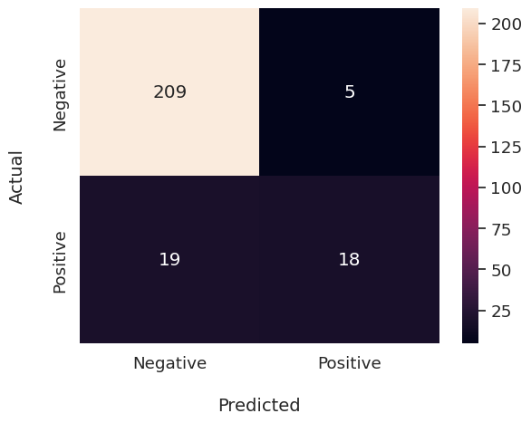

## Machine Learning

For this project, we wanted to create a model that would classify the sentiments of the tweets. Since there were available pre-trained models on tweet data, we decided to go with a supervised-learning based model.

First, we load the data and accessed the Lemmatized column

```py
data_frame = pd.read_csv("clean_9.csv")
lemmatized_column = data_frame["Lemmatized"]
```

The pre-trained model we will be using will be provided by HuggingFace, in which we have to import the `pipeline` method from `transformers` library.

```py
from transformers import pipeline
sentiment_pipeline = pipeline("sentiment-analysis")
lemmatized_column = lemmatized_column.tolist() # convert to list
labels = sentiment_pipeline(lemmatized_column)
```

Afterwards, we then extract the labels generated by the function and append it to our dataframe.

```py
sentiments = [d['label'] for d in labels]
data_frame['Sentiment'] = sentiments
```

Now, we map the corresponding labels to integers and then assign X to the feature (tweet data) and Y to be the target (sentiment)

```py
data_frame['Sentiment_num'] = data_frame.Sentiment.map({'NEGATIVE':-1, 'POSITIVE':1, 'NEUTRAL': 0})
X = data_frame.Lemmatized
y = data_frame.Sentiment_num
```

Here we make use of the TfidVectorizer and then use over-sampling since our data is very skewed to negative tweets.

```py
from sklearn.feature_extraction.text import TfidfVectorizer
from sklearn.metrics import accuracy_score, precision_score, recall_score, f1_score
from sklearn.model_selection import train_test_split
from imblearn.over_sampling import RandomOverSampler
from sklearn.naive_bayes import GaussianNB


X_train, X_test, y_train, y_test = train_test_split(X, y, test_size=0.3, random_state=2)

vect = TfidfVectorizer()
vect.fit(X_train)

X_train_tf = vect.transform(X_train)
X_train_tf = X_train_tf.toarray()
X_test_tf = vect.transform(X_test)
X_test_tf = X_test_tf.toarray()

ROS = RandomOverSampler(sampling_strategy=1)
X_train_ros, y_train_ros = ROS.fit_resample(X_train_tf, y_train)
```

We then use a Gaussian Naive Bayes classifier to classify and predict tweets

```py
nb = GaussianNB()
nb.fit(X_train_ros, y_train_ros)
y_preds = nb.predict(X_test_tf)
```

We then test the accuracy of the model by printing out the classification report and confusion matrix

```py
from sklearn.metrics import classification_report, confusion_matrix
print(classification_report(y_test, y_preds))
print(confusion_matrix(y_test, y_preds))
```

As we can see the model has an accuray of 90% however we cannot hide the fact that the model is not good at predicting positive tweets given the low f1-score (60%)

```py
              precision    recall  f1-score   support

          -1       0.92      0.98      0.95       214
           1       0.78      0.49      0.60        37

    accuracy                           0.90       251
   macro avg       0.85      0.73      0.77       251
weighted avg       0.90      0.90      0.89       251
```

Here is the result of the confusion matrix visualized using seaborn.



## Statistical Model

Since we aim to check if there is a prevailing sentiment or not, we can use the Binomial Test. The [Binomial test](https://www.ibm.com/docs/en/spss-statistics/beta?topic=tests-binomial-test) compares the frequencies of two categories. In our case, we compare the the categories `POSITIVE` and `NEGATIVE` sentiment. We can then check if both categories have the same distribution over our set of 153 tweets.

To do this, we first separate the tweets labelled `POSITIVE` and `NEGATIVE` into two dataframes.

```py
positive = dataset.loc[dataset['Sentiment Num'] > 0]
negative = dataset.loc[dataset['Sentiment Num'] == 0]
```

Afterwards, we can apply `scikit-learn`'s `binomtest` function

```
binomtest(len(negative), n=len(positive)+len(negative))
```

_Note that by default, this runs a two-tailed binomial test._

We've obtained a p-value of $4.7e-7$ which tells us that the distribution of `NEGATIVE` within the test set is not 50% and hence there **exists** a prevailing sentiment.

We can then check the count by printing the following:

```py
print("Number of positive tweets: ", len(positive))
print("Number of negative tweets: ", len(negative))
```

This yields us: 22 positive tweets and 131 negative tweets. Therefore, the tweets gathered are deemed to be largely negative in sentiment.
